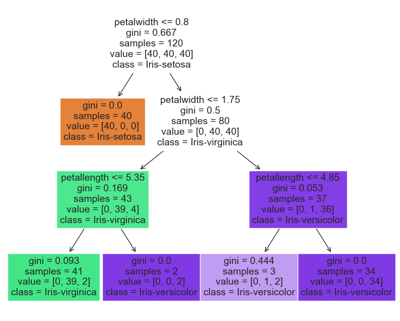

<html><body class="c31 doc-content">
Building a Real-Time AI Pipeline with Pulsar Functions: The Basics

<h2 class="c11" id="h.ds0e7qcro4aj">Motivation</h2>

The need for AI and Machine Learning in decision making across a wide array of industries is no secret. But despite the incredible compute power available, and the constant stream of real-time event data, the subclass of &quot;Real-Time AI&quot; is somewhat under-addressed - Particularly is it pertains to live model-retraining and assessment.

Pulsar functions, which implement serverless compute on top of the well-known open source framework Apache Pulsar, provide a convenient and powerful solution which addresses limitations in the traditional ML workflow. It takes advantage of the inherent Pub-Sub nature of the platform in order to provide a framework for true Real-Time AI. Of course, the scope of Pulsar Functions extends far beyond this domain, but we aim to illustrate how the flexibility of Pulsar Functions is a potential solution for machine learning pipelines that require immediate and real-time predictions and results.

<h2 class="c11" id="h.egg9i0snll2c">Overview</h2>

Our goal is to build a real-time inference engine, powered by Pulsar Functions, that can retrieve low-latency predictions both one at a time, and in bulk. To accomplish this, we have two primary development goals:

<ol class="c23 lst-kix_9lskibkiymne-0 start" start="1"><li class="c2 c22 li-bullet-0">We must install, configure, and launch Pulsar itself</li><li class="c2 c22 li-bullet-0">We must define the Python functions which will underpin the inference engine</li></ol>

The remainder of this blog walks through those steps, with a particular focus on the Python development side, as well as the calling interface for both registering and triggering Pulsar Functions.
<h3 class="c5" id="h.pttoe3ge7i6h">Pulsar Standalone</h3>

With<a href="#cmnt1" id="cmnt_ref1">[a]</a><a href="#cmnt2" id="cmnt_ref2">[b]</a><a href="#cmnt3" id="cmnt_ref3">[c]</a>&nbsp;that said, let&#39;s get started by launching a Standalone Pulsar instance. We should note immediately that in a typical deployment of this type of system, Pulsar would be deployed in a Cluster, certainly not a standalone instance on a local machine. But this will allow us to see the power of Real-Time AI prior to a more production-quality deployment.

Follow the instructions available at: &lt;https://pulsar.apache.org/docs/2.11.x/getting-started-standalone&gt;

The Pulsar Standalone instance will be started with the command:

<table class="c3"><tr class="c4"><td class="c24" colspan="1" rowspan="1">
bin/pulsar standalone
</td></tr></table>

<h2 class="c11 c33" id="h.m4xzoel7i6sh"></h2><h3 class="c5" id="h.tbawerpsmntb">Iris Flowers Data</h3>

With the instance running, we now turn our attention to defining the Pulsar function that will provide our ML example. We will use the classical Iris Flowers dataset. Collected by Edgar Anderson and popularly used by Ronald Fisher, this dataset contains measurements on 50 flowers, spanning three different flower species. The variables included are as follows:

<ul class="c23 lst-kix_ep8b09vb2761-0 start"><li class="c2 c22 li-bullet-0">sepallength: The measured length of the flower&#39;s sepal</li><li class="c2 c22 li-bullet-0">sepalwidth: The measured width of the flower&#39;s sepal</li><li class="c2 c22 li-bullet-0">petallength: The measured length of the flower&#39;s petal</li><li class="c2 c22 li-bullet-0">petalwidth: The measured width of the flower&#39;s petal</li><li class="c2 c22 li-bullet-0">class: The species of flower (Setosa, Versicolor, Virginica)</li></ul>

A small preview of this data is given below:

<table class="c3"><tr class="c4"><td class="c1" colspan="1" rowspan="1">
sepallength
</td><td class="c1" colspan="1" rowspan="1">
sepalwidth
</td><td class="c1" colspan="1" rowspan="1">
petallength
</td><td class="c1" colspan="1" rowspan="1">
petalwidth
</td><td class="c1" colspan="1" rowspan="1">
class
</td></tr><tr class="c4"><td class="c1" colspan="1" rowspan="1">
5.1
</td><td class="c1" colspan="1" rowspan="1">
3.5
</td><td class="c1" colspan="1" rowspan="1">
1.4
</td><td class="c1" colspan="1" rowspan="1">
0.2
</td><td class="c1" colspan="1" rowspan="1">
Iris-setosa
</td></tr><tr class="c4"><td class="c1" colspan="1" rowspan="1">
4.9
</td><td class="c1" colspan="1" rowspan="1">
3.0
</td><td class="c1" colspan="1" rowspan="1">
1.4
</td><td class="c1" colspan="1" rowspan="1">
0.2
</td><td class="c1" colspan="1" rowspan="1">
Iris-setosa
</td></tr><tr class="c4"><td class="c1" colspan="1" rowspan="1">
4.7
</td><td class="c1" colspan="1" rowspan="1">
3.2
</td><td class="c1" colspan="1" rowspan="1">
1.3
</td><td class="c1" colspan="1" rowspan="1">
0.2
</td><td class="c1" colspan="1" rowspan="1">
Iris-setosa
</td></tr></table>

Our goal will be to accurately predict the class&nbsp;given the input features. We will implement the two core components of the model pipeline: training and prediction. The training step will be an offline step (more on this later!) while the prediction step will be the core routine of our Pulsar function. Let&#39;s get started!
<h2 class="c11" id="h.4n74soex84xd">Pulsar Functions</h2>
Now, we are ready to both build and deploy our Pulsar Function.
<h3 class="c5" id="h.o7rio7xrocus">Building our Pulsar Function</h3>

Pulsar functions can be created in a single, standalone Python script, containing the functions which will be deployed. As mentioned, we are going to have the model prediction routine be our primary Pulsar function. A powerful piece of this framework is that the functions themselves are largely standard Python functions, with minimal Pulsar-specific scaffolding. This makes the time to deployment for existing code, or the time to creation for more seasoned Python developers, extremely minimal. Let&#39;s start with a basic framework for pulling Iris data, training a model, and writing it to a Pulsar Topic.

<table class="c3"><tr class="c4"><td class="c35" colspan="1" rowspan="1">
import&nbsp;os import&nbsp;pickle import&nbsp;pandas as&nbsp;pd from&nbsp;pulsar import&nbsp;Function from&nbsp;sklearn.model_selection import&nbsp;train_test_split from&nbsp;sklearn.tree import&nbsp;DecisionTreeClassifier   def&nbsp;train_iris_model():  &nbsp; &nbsp;# If we already have an existing model file, we can load it right away  &nbsp; &nbsp;if&nbsp;os.path.exists(&quot;model.pkl&quot;):<a href="#cmnt4" id="cmnt_ref4">[d]</a><a href="#cmnt5" id="cmnt_ref5">[e]</a>

&nbsp; &nbsp; &nbsp; &nbsp; print(&quot;We are loading a pre-existing model&quot;)  &nbsp; &nbsp; &nbsp; &nbsp;return&nbsp;pickle.load(open(&quot;model.pkl&quot;, &#39;rb&#39;))   &nbsp; &nbsp;# Read in the iris data, split into a 20% test component  &nbsp; &nbsp;iris = pd.read_csv(&quot;https://datahub.io/machine-learning/iris/r/iris.csv&quot;)  &nbsp; &nbsp;train, test = train_test_split(iris, test_size=0.2, stratify=iris[&#39;class&#39;])   &nbsp; &nbsp;# Get the training data  &nbsp; &nbsp;X_train = train[[&#39;sepalwidth&#39;, &#39;sepallength&#39;, &#39;petalwidth&#39;, &#39;petallength&#39;]]  &nbsp; &nbsp;y_train = train[&#39;class&#39;]   &nbsp; &nbsp;# Get the test data  &nbsp; &nbsp;X_test = test[[&#39;sepalwidth&#39;, &#39;sepallength&#39;, &#39;petalwidth&#39;, &#39;petallength&#39;]]  &nbsp; &nbsp;y_test = test[&#39;class&#39;]   &nbsp; &nbsp;# Train the model   &nbsp; &nbsp;model = DecisionTreeClassifier(max_depth=3, random_state=1)  &nbsp; &nbsp;model.fit(X_train, y_train)   &nbsp; &nbsp;# Dump the model object to a file  &nbsp; &nbsp;pickle.dump(model, open(&quot;model.pkl&quot;, &#39;wb&#39;))   &nbsp; &nbsp;return&nbsp;model
</td></tr></table>

In this code block, we train a Decision Tree Classifier in an attempt to predict the flower species based on the width and length of the sepals and petals. A Decision Tree Classifier can be intuitively represented as a series of decisions based on feature values, culminating in a prediction when a leaf node of the tree is reached. An example tree derived from this model is given below:

One thing to note - we use the pickle&nbsp;module to serialize the model upon training. This will dump the model to a file in the working directory<a href="#cmnt6" id="cmnt_ref6">[f]</a><a href="#cmnt7" id="cmnt_ref7">[g]</a>. Subsequent calls to the function will, if the pickled model is available, simply read the model in rather than go through the (sometimes expensive) retraining steps. This will be a key point as we continue fleshing out the example, since it allows for a separate routine that is responsible for continual assessment, augmentation, and re-training of the model as new data is collected.

Thus far, we have written the code that will train the Decision Tree Classification Model. It&#39;s time to build the routine which will represent our Pulsar Function. We will create a sub-class IrisPredictionFunction&nbsp;of the Function class in Pulsar, implementing two methods: an __init__() method which does nothing, and a __process__() method which, given an input and a user context, returns a prediction from the model.

<table class="c3"><tr class="c4"><td class="c35" colspan="1" rowspan="1">
class&nbsp;IrisPredictionFunction(Function):  &nbsp; &nbsp;# No initialization code needed  &nbsp; &nbsp;def&nbsp;__init__(self):  &nbsp; &nbsp; &nbsp; &nbsp;pass   &nbsp; &nbsp;def&nbsp;process(self, input, context):  &nbsp; &nbsp; &nbsp; &nbsp;# Convert the input ratio to a float, if it isn&#39;t already  &nbsp; &nbsp; &nbsp; &nbsp;flower_parameters = [float(x) for&nbsp;x in&nbsp;input.split(&quot;,&quot;)]   &nbsp; &nbsp; &nbsp; &nbsp;# Get the prediction  &nbsp; &nbsp; &nbsp; &nbsp;model = train_iris_model()  &nbsp; &nbsp; &nbsp; &nbsp;return&nbsp;model.predict([flower_parameters])[0]
</td></tr></table>

This function does not depend on the user context - parameters and configuration options specific to the calling user could be used to tweak the behavior, if desired. But for this function, we simply rely on the input. Since the model was trained on the four flower features sepallength, sepalwidth, petallength, and petalwidth, we must provide each, and in the order that the model was trained. For ease and simplicity, we assume that these are passed as a comma separated string. For example, the consider the following string:

1.8,2.1,4.0,1.4

This represents a flower with the following measurements:

<ul class="c23 lst-kix_lww5lmxnm8sf-0 start"><li class="c2 c22 li-bullet-0">sepallength: 1.8</li><li class="c2 c22 li-bullet-0">sepalwidth: 2.1</li><li class="c2 c22 li-bullet-0">petallength: 4.0</li><li class="c2 c22 li-bullet-0">petalwidth: 1.4</li></ul>

Our pulsar function will take this string, split on the comma, convert the values to floats, and then pass it to the model prediction routine.

<h3 class="c5" id="h.ma7ycx5g0to5">Deploying our Pulsar Function</h3>

Now for the easy part - deployment! With the `pulsar standalone` client running, we need only to create and trigger our function. We first create it, like so:

<table class="c3"><tr class="c4"><td class="c24" colspan="1" rowspan="1">
bin/pulsar-admin functions create \ &nbsp; &nbsp; &nbsp; &nbsp; &nbsp; &nbsp; &nbsp;   &nbsp;--tenant public \  &nbsp;--namespace default \  &nbsp;--name iris_prediction_1 \  &nbsp;--py iris_prediction.py \ &nbsp; &nbsp; &nbsp;  &nbsp;--timeout-ms 10000&nbsp;\  &nbsp;--classname iris_prediction.IrisPredictionFunction \  &nbsp;--inputs persistent://public/default/in \ &nbsp; --output persistent://public/default/out
</td></tr></table>

Note a few parameters:

<ul class="c23 lst-kix_gmo547uclqx5-0 start"><li class="c2 c22 li-bullet-0">--name&nbsp;provides us with the name to reference the function to trigger it in the future. This can be whatever is most convenient, but should be unique.</li><li class="c2 c22 li-bullet-0">--py&nbsp;is the name of the python script which contains the code we have written. Here, I&#39;ve saved our code as a script iris_prediction.py&nbsp;which is included with this blog.</li><li class="c2 c22 li-bullet-0">--classname&nbsp;is the name of the class within the python script, fully qualified, as shown above.</li></ul>

Finally, we can trigger our function! Let&#39;s pass in the parameters we used as an example above:

<table class="c3"><tr class="c4"><td class="c24" colspan="1" rowspan="1">
bin/pulsar-admin functions trigger \  &nbsp;--tenant public \  &nbsp;--namespace&nbsp;default \  &nbsp;--name iris_prediction_1 \  &nbsp;--trigger-value 1.8,2.1,4.0,1.4
</td></tr></table>

<h2 class="c11" id="h.9rstjawedt9g">Bonus: Bulk Prediction</h2>

This function works great for the predicted species of a single Iris flower. But in the real world, we may wish to obtain predictions for a large number of observations at once. Fortunately, this is a trivial modification to the above function, and can be included along-side the single flower prediction function. Let&#39;s add the following class, which we will use to create a new Pulsar Function:

<table class="c3"><tr class="c4"><td class="c35" colspan="1" rowspan="1">
class&nbsp;IrisPredictionFunctionBulk(Function):  &nbsp; &nbsp;# No initialization code needed  &nbsp; &nbsp;def&nbsp;__init__(self):  &nbsp; &nbsp; &nbsp; &nbsp;pass   &nbsp; &nbsp;def&nbsp;process(self, input, context):  &nbsp; &nbsp; &nbsp; &nbsp;# Convert the input parameters to floats, if they aren&#39;t already  &nbsp; &nbsp; &nbsp; &nbsp;flower_parameters_str = input.split(&quot;:&quot;)  &nbsp; &nbsp; &nbsp; &nbsp;flower_parameters_split = [x.split(&quot;,&quot;) for&nbsp;x in&nbsp;flower_parameters_str]  &nbsp; &nbsp; &nbsp; &nbsp;flower_parameters_float = [[float(x) for&nbsp;x in&nbsp;y] for&nbsp;y in&nbsp;flower_parameters_split]   &nbsp; &nbsp; &nbsp; &nbsp;# Get the prediction  &nbsp; &nbsp; &nbsp; &nbsp;model = train_iris_model()  &nbsp; &nbsp; &nbsp; &nbsp;return&nbsp;&quot;, &quot;.join(model.predict(flower_parameters_float))
</td></tr></table>

This function is similar, but:

1. Defines a new class name to allow us to distinguish it when registering the function

2. Assumes that we may have more than one set of flower measurements, split by a `:` character

3. Joins the resulting model predictions into a comma-separated string of predictions, rather than an array

Much like before, we register the function, making sure to define a new name and refer to the correct class name that we just created:

<table class="c3"><tr class="c4"><td class="c24" colspan="1" rowspan="1">
bin/pulsar-admin functions create \  &nbsp;--tenant public \  &nbsp;--namespace default \  &nbsp;--name iris_prediction_bulk_1 \  &nbsp;--py iris_prediction.py \  &nbsp;--timeout-ms 10000&nbsp;\  &nbsp;--classname iris_prediction.IrisPredictionFunctionBulk \  &nbsp;--inputs persistent://public/default/in \ &nbsp; --output persistent://public/default/out
</td></tr></table>

And finally, we trigger the function - let&#39;s pass in three sets of flower measurements at once, like so:

<table class="c3"><tr class="c4"><td class="c24" colspan="1" rowspan="1">
bin/pulsar-admin functions trigger \  &nbsp;--tenant public \  &nbsp;--namespace&nbsp;default \  &nbsp;--name iris_prediction_bulk_1 \  &nbsp;--trigger-value 1.8,2.1,4.0,1.4:0.1,0.1,0.1,0.1:1.8,2.5,0.5,5.0
</td></tr></table>

And there we have it! Real-time predictions of Iris flower species based on the measurements, using Pulsar Functions in Python.

<h2 class="c11" id="h.z11xgbfei6dz">Conclusion</h2>

While this example merely scratches the surface of what&#39;s possible with Pulsar Functions, I believe it provides a blueprint for implementing a Real-Time AI pipeline using Apache Pulsar. With Pulsar&#39;s power underlying the core framework, complex Pub-Sub systems with large amounts of real-time data can be seamlessly processed, with the resulting output from the inference model consumed directly, or even used in a downstream task.

</body></html>
